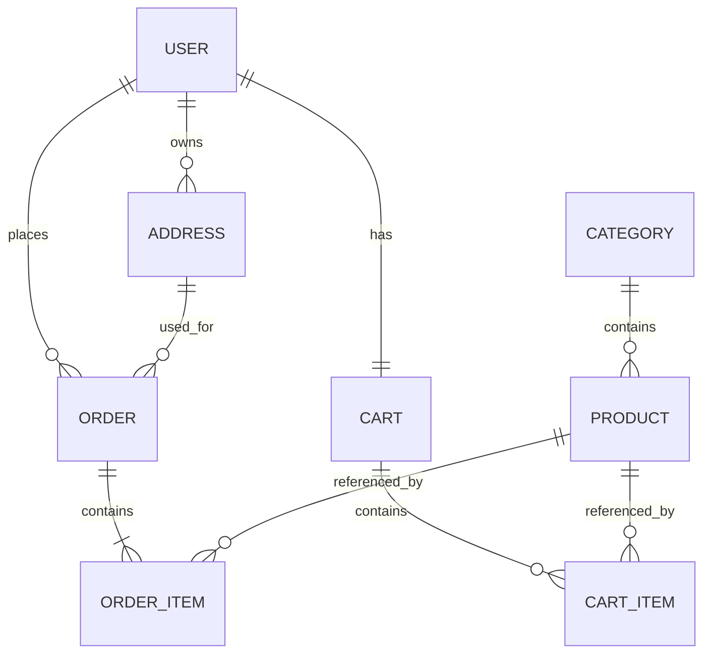

# Database ERD

## 1. Scope

SQL Server is the primary database and Entity Framework Core is the only application schema-management path. This document is the logical ERD reference; code and migrations must remain consistent with it.

The implementation baseline is .NET 10 with EF Core 10 and SQL Server.

Sprint 1 delivered `User`, `Category`, and `Product`. Active Sprint 2 owns `Address`, `Cart`, `CartItem`, `Order`, and `OrderItem` for the COD customer journey. Inventory administration, order cancellation, and administrative order status behavior remain Sprint 3.

## 2. Logical ERD

## 3. Entity Reference

| Entity | Key fields | Constraints and notes | Sprint |
| --- | --- | --- | --- |
| `User` | `Id`, `FullName`, `Email`, `PasswordHash`, `Role`, `CreatedAt` | Email unique after normalization; role is `Admin` or `Customer`; password hash never leaves backend | 1 |
| `Category` | `Id`, `Name`, `Description`, `CreatedAt` | Name uniqueness and delete behavior require Acceptance Criteria before migration | 1 |
| `Product` | `Id`, `CategoryId`, `Name`, `Description`, `Price`, `Brand`, `ImageUrl`, `StockQuantity`, `CreatedAt`, `UpdatedAt` | Required Category FK; `Price decimal(18,2) >= 0`; stock non-negative | 1 |
| `Address` | `Id`, `UserId`, `ReceiverName`, `Phone`, `AddressLine`, `IsDefault` | Required User FK; default-address invariant belongs to service rules | 2 |
| `Cart` | `Id`, `UserId`, `CreatedAt` | One cart per User | 2 |
| `CartItem` | `Id`, `CartId`, `ProductId`, `Quantity` | Unique Cart/Product pair; quantity positive | 2 |
| `Order` | `Id`, `UserId`, shipping snapshot, `Status`, `PaymentMethod`, `TotalAmount`, `CreatedAt`, `UpdatedAt` | COD ordering/history is Sprint 2; admin status changes are Sprint 3; money uses `decimal(18,2)` | 2 |
| `OrderItem` | `Id`, `OrderId`, `ProductId`, `Quantity`, `UnitPrice` | Snapshot price uses `decimal(18,2)`; quantity positive | 2 |

## 4. Relationship Rules

- A Category has many Products; each Product has one Category.
- A User has many Addresses, exactly one Cart, and many Orders.
- A Cart has many CartItems; a Product may appear in many CartItems.
- An Order uses one Address and contains at least one OrderItem.
- A Product may be referenced by many OrderItems.
- Delete behavior must be explicit in EF configuration. Do not introduce cascade deletion of business records without Product Owner and team agreement.

## 5. Migration Rules

1. Change the Entity and EF configuration together.
2. Generate an EF Core migration with a task-specific name.
3. Review generated SQL, data-loss warnings, constraints, and indexes.
4. Apply migrations locally and run affected tests.
5. Commit Entity, configuration, migration, ERD update, and API impact together.

Never edit a shared database manually without an equivalent tracked migration. Never rename a field or Entity until API, frontend, data, and migration impacts are agreed.
